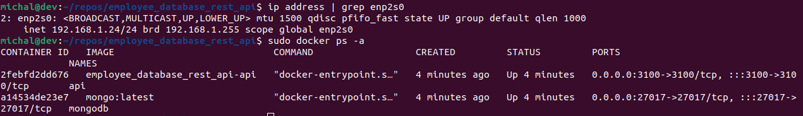
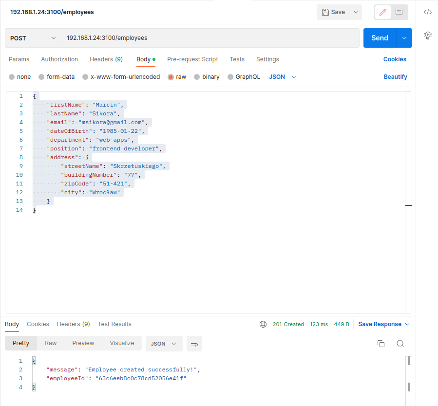

# Employee database REST API

## Table of contents

- [Introduction](#introduction)
- [Technologies used](#technologies-used)
- [Setup](#setup)

## Introduction

This project is a REST API which is used to handle the employee database, via CRUD operations.
All the API documentation you can find [here](https://documenter.getpostman.com/view/25365465/2s8ZDVZ3Yh).

All of software is running in Docker containers.

## Technologies used

- Backend - <b>node.js</b> used with <b>express.js</b>.
- Database - <b>mongoDB</b> used with ODM <b>Mongoose</b>.
- Others:
  - Docker,
  - JSON web token,
  - express validator,
  - bcrypt.

## Setup

To run the project (tested on Debian 11):

1. Make sure you have `docker` and `docker compose` installed.
2. Login to your server and clone the repository.
3. Enter the repo and search for `.env.example` file.
4. Put there all of informations.
5. Rename `.env.example` file to `.env`.
6. Run the containers by using `docker compose up -d` in main folder (includes `docker-compose.yml` file).
7. When docker compose process will end you can check containers by using `docker ps -a`.

8. You can check the API by sending requests on the adress of the server which has installed software on.

